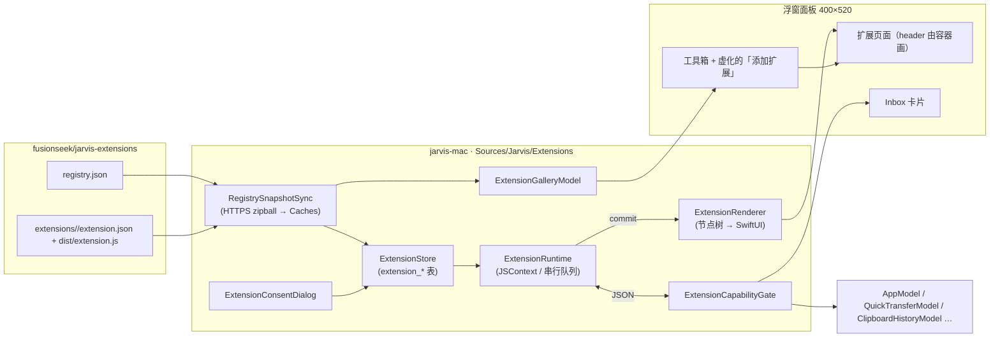
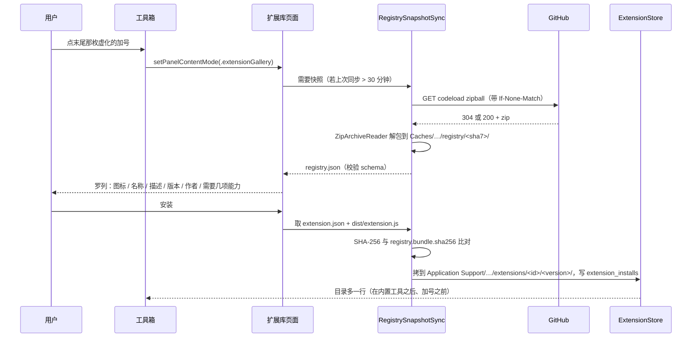
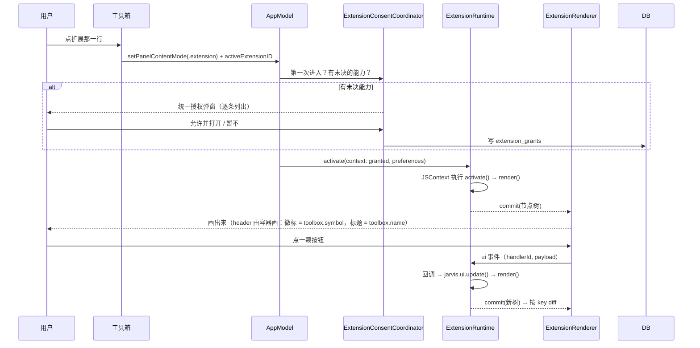
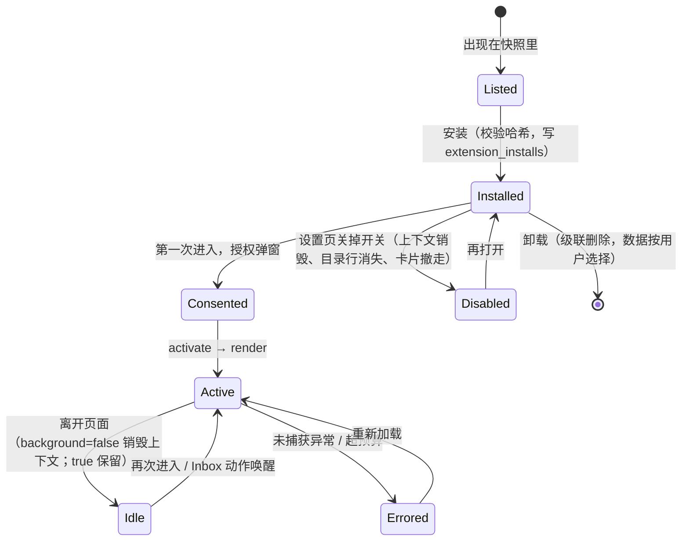

# 框架层级设计

## Overview

三个东西、两条边界：

- **仓库**（本仓库）：扩展的源码与产物、`registry.json`、schema、SDK。它是扩展库的**真源**，
  宿主只读不写。
- **宿主**（`jarvis-mac` 的 `Sources/Jarvis/Extensions/`）：把仓库快照拉到本机、罗列、安装、
  跑扩展的 JS、把节点树画成 SwiftUI、把每一次能力调用拦在闸门上。
- **扩展**（一个 `JSContext`）：只认识 `jarvis` 这一个全局对象与它自己的状态。

边界一在**仓库与宿主之间**：宿主认的只有 `registry.json` 与 `extension.json` 两份 schema
化的事实，产物按 SHA-256 校验。边界二在**宿主与扩展之间**：两边只交换 JSON 字符串，
扩展没有 DOM、没有文件系统、没有网络，每一次调用都过能力闸门。

## Architecture & Logic



### 分层落位（对齐 `jarvis-mac` 的项目边界）

| 层 | 新增类型 | 职责 | 边界 |
| --- | --- | --- | --- |
| `Domain` | `ExtensionManifest`、`ExtensionRegistry`、`ExtensionCapability`、`ExtensionGrantPolicy`、`ExtensionCatalogPolicy`、`ExtensionCompatibilityPolicy`、`ExtensionUINode` / `ExtensionUIDiff`、`ExtensionRateLimitPolicy` | 纯值与纯函数：manifest 解析与校验、能力风险档位、授权判定、目录合并顺序、版本兼容、节点树 diff、频率限制 | **不 import SwiftUI、不碰 JavaScriptCore** |
| `Infrastructure` | `RegistrySnapshotSync`、`ExtensionStore`（`extension_*` 五张表）、`ExtensionBundleVerifier`、`ExtensionJSContext`、`ExtensionNetClient` | 拉快照、解包、校验哈希、建 `JSContext`、SQLite 读写、HTTPS 白名单请求 | `OpaquePointer` 与 `JSContext` 不越出本层 |
| `App` | `ExtensionCenterModel`（已装 / 可装 / 更新）、`ExtensionSessionModel`（一个活着的扩展）、`ExtensionCapabilityGate`、`ExtensionConsentCoordinator`、`ExtensionInboxBridge` | `@MainActor` 状态；把闸门后的调用转给既有模型（`QuickTransferModel.shared`、`ClipboardHistoryModel.shared`、`AppModel.shared` …） | 只调既有模型的公开方法，不复制它们的逻辑 |
| `UI` | `FloatingExtensionGalleryView`、`FloatingExtensionHostView`、`ExtensionRenderer` + 30 个节点视图、`ExtensionConsentDialog`、设置页 `extensionsSection`、`JarvisDesign.Extensions` tokens | 画 | 不承载协议解析；节点视图只读 `JarvisDesign` |

### 数据流：从仓库到工具箱那一行



### 数据流：进入一个扩展



## Concepts

### 快照：宿主怎么"访问 git 仓库"

宿主**不调用 `git`**。`/usr/bin/git` 在没装 Command Line Tools 的机器上会弹一扇「需要安装
命令行开发者工具」的系统对话框——一个常驻的菜单栏应用不能在用户点开扩展库的那一下弹出这种东西
（`jarvis-mac` 在 `adb` 上吃过同一种亏：`docs/uiux/floating-status/floating-panel.md`「不靠 PATH 找 adb」）。
它也不走 SSH：`git@github.com:fusionseek/jarvis-extensions.git` 是给开发者提交用的地址，
匿名读取走 HTTPS。

快照的做法：

| 项 | 值 | 为什么 |
| --- | --- | --- |
| 来源 | `https://codeload.github.com/fusionseek/jarvis-extensions/zip/refs/heads/main` | 一次请求拿到整份仓库（registry + 全部产物），不受 `api.github.com` 每小时 60 次的匿名限流 |
| 落点 | `~/Library/Caches/<ProductIdentity.supportDirectoryName>/extensions/registry/<sha7>/` | 用户要的是「临时目录」：Caches 是可重建数据的语义位置，系统可清、清了再拉；调试渠道有自己的目录（`Jarvis Dev`） |
| 解包 | `ZipArchiveReader`（既有，`mmap` + deflate） | 零新依赖；`Compression` 框架处理 deflate |
| 条件请求 | `If-None-Match` + 上次的 `ETag` | 没变就 304，一个字节都不下 |
| 节奏 | 打开扩展库时距上次同步 ≥ 30 分钟才拉；页面上有「刷新」 | 页面先画缓存里的那一份，再在后台换新；不让用户对着转圈等 |
| 单值状态 | `UserDefaults`：`extensions.registry.lastSyncAt` / `.etag` / `.sha` | 标量偏好留在 UserDefaults，与本地持久化门禁一致 |
| 大小上限 | 归档 ≤ 64 MB，解包后 ≤ 256 MB | 超过即拒绝并提示「扩展库快照超出上限」；不是安全边界，是不让一个失控的仓库把用户的磁盘吃掉 |

**前提：仓库必须是 public。** 私有仓库匿名拉不到 zipball，而扩展库页面没有登录这一步。

快照里的 `registry.json` 先过 `registry.v1.schema.json` 校验；校验失败整份快照作废，
页面显示上一份能用的快照并写明「最新快照无法解析」——**不猜、不部分采用**。

### 安装记录与运行时文件

安装 = 把快照里那个扩展目录的 `extension.json` 与 `main` 指向的 bundle 拷到

```text
~/Library/Application Support/<supportDirectoryName>/extensions/<id>/<version>/
```

并在 `extension_installs` 写一行。拷之前先算 bundle 的 SHA-256 与 `registry.json` 里的
`bundle.sha256` 比对，不等就拒绝。**bundle 是不可执行的文本文件**，它只会被 `JSContext.evaluateScript`
读进内存，永远不会被 `open`、不会被 `chmod +x`。

更新 = 装新版本到 `<id>/<newVersion>/`，切换 `extension_installs.version`，删旧目录。
授权与偏好按 `extension_id` 存，跨版本保留；**新版本新增的能力回到未决状态**，下次进入再问一次。

卸载 = 删目录、删 `extension_installs` 行、级联删 `extension_grants` / `extension_inbox_cards`；
`extension_preferences` 与 `extension_documents` 由用户在卸载确认里选「同时删除数据」才删——
用户写下的东西没有任何后台任务有权替他删。

### 运行时：一个扩展一个 `JSContext`

| 项 | 值 | 为什么 |
| --- | --- | --- |
| 隔离 | 每个扩展一个 `JSVirtualMachine` + `JSContext`，一条串行 `DispatchQueue` | 内存互不可见；一个扩展死循环不拖住另一个 |
| 全局环境 | 只有 ES2020 标准库 + `__jarvisHost`；**没有** `fetch` / `XMLHttpRequest` / `setTimeout` 以外的宿主对象 | 能做的每一件事都必须经过闸门 |
| 定时器 | `setTimeout` / `setInterval` 由宿主实现，每个扩展最多 8 个活动定时器，最短 100 ms | 防止一个扩展把主线程喂满 |
| 同步预算 | 一次事件回调（含 `render()`）超过 200 ms 记一次警告，超过 2 s 终止上下文 | 主线程上等的是用户的一次点击 |
| 内存 | `JSVirtualMachine` 单独计量；超过 128 MB 终止 | 同上 |
| 加载 | 进入时 `evaluateScript(bundle)`；`background: false` 的扩展离开页面即 `deactivate` 并**销毁上下文** | 不常驻的扩展不该在后台占着任何东西 |
| 常驻 | `background: true` 且被授予 `inbox.post` 或有 `observe` 订阅的扩展，离开页面后保留上下文 | 它要在后台投卡片；没有这两样却声明 `background` 的 manifest 审核不通过 |
| 崩溃 | 未捕获异常 / 终止 → 扩展页面进**错误屏**（一张 `danger` 语义卡 + 「重新加载」+ 「查看日志」），Inbox 与设置照常 | 一个扩展坏了不能把面板变空白 |

线缆协议（`sdk/src/bridge.ts`）：

| 方向 | 消息 | 说明 |
| --- | --- | --- |
| SDK → 宿主 | `invoke(json)` | 异步能力调用；宿主回 `settle` |
| SDK → 宿主 | `invokeSync(json) → json` | 纯函数工具（`text.*` / `time.*` / `color.*`）与 `host.info` / `host.environment`；不经事件循环 |
| SDK → 宿主 | `commit(json)` | 一棵序列化的节点树，带 `generation` |
| SDK → 宿主 | `log(level, message, data)` | 进设置页的扩展日志（只留最近 200 条） |
| 宿主 → SDK | `dispatch(json)` | `activate` / `deactivate` / `settle` / `ui` / `subscription` / `preferencesChanged` / `permissionsChanged` / `inboxAction` / `notificationActivated` |

线缆协议有自己的版本号（`bridgeProtocolVersion`），与 SDK 主版本同步；不一致时宿主拒绝加载，
扩展页面写明「这个扩展需要 SDK 2，当前 Jarvis 只支持 SDK 1」，扩展库卡片上同理。

### 能力闸门

每一次 `invoke` 先走 `ExtensionCapabilityGate`：

1. `namespace.method` 映射到一个 `CapabilityID`（或隐式）；映射不到 → `capability.unknown`；
2. manifest 没声明 → `capability.undeclared`（**先查声明再查授权**：一个没声明的能力即使被授予也不放行，
   否则审核时看到的清单就不是它真能用的清单）；
3. `extension_grants` 里没有 `granted = 1` → `permission.denied`；
4. 依赖的系统权限不在 → `permission.unavailable`；
5. 频率与体积（`ExtensionRateLimitPolicy`）→ `rate.limited`；
6. 放行，转给对应的既有模型。

**闸门只认 `(extension_id, capability)`**，不认调用栈——扩展里不存在能绕过 `__jarvisHost.invoke` 的路径。

需要用户动作的能力（`panel.collapse`、`permissions.request`、`screenshot.capture`、`files.pick`）
还要求调用发生在一次 `ui` 事件回调之后 1 秒内，否则 `invalid.argument`：一个在后台自己弹选择器、
自己收面板的扩展，用户看到的是"Jarvis 自己动了"。

### 渲染器

`commit` 的树先过 `ExtensionUINode` 解析（每种 `kind` 一个 `Codable` 结构，未知 kind 整棵拒绝，
未知 prop 忽略并记警告），再与上一棵树按 `key` diff 成 `ExtensionUIDiff`，最后由 SwiftUI 视图树消费。
节点数上限 500，文本单条 ≤ 20 000 字符，`list` 走 `LazyVStack`。每个节点视图**只读 `JarvisDesign`**，
逐项对应表在 [07 · UI 组件目录](07-ui-components.md)。

### 存储：五张表

全部进 `jarvis.sqlite3`，同一个迁移版本（v8）加出来，每张表都写保留策略：

| 表 | 一行是什么 | 保留策略 |
| --- | --- | --- |
| `extension_installs` | 一个已安装的扩展：`extension_id`（UNIQUE）、`version`、`bundle_sha256`、`source`（`registry` / `local`）、`local_path`、`enabled`、`installed_at`、`updated_at`、`created_at` | 永不自动删除；用户卸载时删 |
| `extension_grants` | 一项授权决定：`extension_id`、`capability`、`granted`、`decided_at`、`created_at`；UNIQUE(`extension_id`, `capability`) | 永不自动删除；随卸载级联 |
| `extension_preferences` | 一条偏好值：`extension_id`、`key`、`value`（JSON 文本）、`updated_at`、`created_at`；UNIQUE(`extension_id`, `key`) | 永不自动删除；卸载时由用户选是否删 |
| `extension_documents` | 扩展自己存的一条：`extension_id`、`key`、`value`（JSON 文本）、`byte_count`、`updated_at`、`created_at`；UNIQUE(`extension_id`, `key`) | **上限：每扩展 2 MB / 2000 条，超出拒绝写入**（不淘汰——扩展的数据不该被悄悄删）；卸载同上 |
| `extension_inbox_cards` | 一张活动卡：`extension_id`、`card_id`、`title`、`body`、`tint`、`symbol`、`actions`（JSON）、`posted_at`、`created_at`；UNIQUE(`extension_id`, `card_id`) | **上限：每扩展 1 张活动卡**，新的替换旧的；用户处理或扩展 `dismiss` 即删除；随卸载级联 |

标量状态（上次同步时间、ETag、开发者模式开关、本地目录路径）留在 `UserDefaults`。
扩展**没有**别的落盘途径：没有文件、没有 plist、没有 Keychain（v1 不支持机密存储，manifest 里
也没有 `secret` 类型的偏好——一个明文存在库里的 API key 比不支持更糟）。

### 版本与兼容

| 维度 | 谁说了算 | 不兼容时 |
| --- | --- | --- |
| SDK 主版本 | manifest `sdk: "^1.0.0"` vs 宿主 `ExtensionRuntime.sdkMajor` | 扩展库卡片灰化并写「需要 SDK 2」；已装的拒绝加载进错误屏 |
| 宿主最低版本 | manifest `minimumJarvisVersion` vs `CFBundleShortVersionString`（`AppVersion` 比较） | 卡片灰化并写「需要 Jarvis ≥ 1.6.0」，安装按钮不可点但不隐藏 |
| 扩展版本 | registry 的 `version` vs `extension_installs.version` | 卡片显示「更新到 x.y.z」 |
| 线缆协议 | `bridgeProtocolVersion` | 同 SDK 主版本 |

宿主升级**不会**悄悄让已装扩展失效：加载失败一律进错误屏并写明原因，扩展库卡片同步标注。

### 安全边界一览

| 威胁 | 挡在哪 |
| --- | --- |
| 仓库里混进恶意扩展 | PR 审核（[13 · 审核清单](13-review-checklist.md)）+ CI 校验 + 用户逐条授权 + 卡片上写明作者与源码地址 |
| 中间人替换产物 | HTTPS + registry 里的 SHA-256 + 安装时比对 |
| 扩展读别的扩展的数据 | 表按 `extension_id` 隔离，闸门只认自己的 id |
| 扩展偷读剪贴板 / 偷开快传 | 没点头拿不到；快传的配对码只给 `quickTransfer.control` |
| 扩展外传数据 | `net.fetch` 只放行白名单主机、只走 HTTPS、响应 ≤ 5 MB、30 s 超时；白名单在授权弹窗里逐条列出 |
| 扩展卡死主线程 | 串行队列 + 同步预算 + 内存上限 + 终止后进错误屏 |
| 扩展冒充 Jarvis 弹窗 | 扩展没有窗口：授权弹窗、文件选择器、系统横幅全部由宿主发起，且横幅带扩展名作来源标签 |
| 扩展在用户背后动面板 | `panel.collapse` / `permissions.request` / `files.pick` 只在用户动作 1 秒内放行 |

## Lifecycle / Disposal



应用退出：所有上下文销毁、活动的 `hold` 释放、订阅撤销。快照目录留着，下次启动直接可用。

## Gotchas

- 扩展库页面与扩展页面都是 `FloatingPanelContentMode` 的 case，属于工具箱那条主线；
  `jarvis-web` 的派生脚本会把它们数成工具——宿主侧实施时必须一并更新
  `sync-from-mac.mjs`（见 [14](14-host-integration-plan.md)）。
- `background: true` 不是"启动时加载"：常驻只在用户至少进入过一次并授权之后才成立。
- 快照目录里的 bundle 与已安装的 bundle 是两份：前者会随刷新整份换掉，后者只在用户点更新时换。
- 扩展不能感知面板是收起还是展开；它只知道自己 `activate` 了没有。要"面板收起了还在跑"的，
  走 `panel.hold` 与 `background`，不要猜。

## Related Links

- [03 · manifest 规范](03-manifest.md)
- [05 · 能力授权模型](05-permissions.md)
- [06 · 能力接口目录](06-capabilities.md)
- [07 · UI 组件目录](07-ui-components.md)
- [14 · jarvis-mac 侧实施方案](14-host-integration-plan.md)
